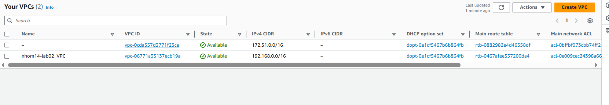

# Hướng dẫn quản lý và triển khai hạ tầng AWS và ứng dụng microservices với Terraform, CloudFormation, GitHub Actions, AWS CodePipeline và Jenkins

## Clone source code

- Clone mã nguồn từ GitHub bằng lệnh sau:

```bash
https://github.com/13octt/DevOps-Technology-Application.git
```

## Terraform
    
### Bước 1: Kết nối với AWS:
       
```bash
aws configure
``` 
- Nhập Access Key và Secret Key để xác thực với AWS

###  Bước 2: Cấu hình Access Key và Secret Key cho dự án
    
```bash
Settings --> Secrets and variables --> Actions
```

<p align="center">
  
  <br>
  <em>Tạo repository secret</em>
</p>

###  Bước 3: Tạo workflows cho Terraform
    
```bash
cd .github/workflows
```

<p align="center">
  
  <br>
  <em>Code pipeline Terraform cho Lab02 trong file terraform.yml</em>
</p>

### Bước 4: Cấu hình trigger Github Actions khi có lệnh push vào một nhánh cụ thể

<p align="center">
  
  <br>
  <em>Trigger pipeline</em>
</p>

### Bước 5: Định nghĩa các stage pipeline cho Terraform

<p align="center">
  
  <br>
  <em>Định nghĩa các stage</em>
</p>

#### 1. Checkout Repository
```bash
    - name: Checkout Repository
      uses: actions/checkout@v4
```

#### 2. Install Checkov
```bash
    - name: "Install Checkov"
      run: pip install checkov
```

#### 3. Run Checkov
```bash
    - name: "Run Checkov"
      run: checkov -f main.tf
      working-directory: Lab02/Terraform/modules/main-modules
```

#### 4. Terraform Init
```bash
    - name: Terraform Init
      run: terraform init
      working-directory: Lab02/Terraform/modules/main-modules
```

#### 5. Terraform Init
```bash
    - name: Terraform Init
      run: terraform init
      working-directory: Lab02/Terraform/modules/main-modules
```

#### 6. Terraform Format
```bash
    - name: Terraform Format
      run: terraform fmt
      working-directory: Lab02/Terraform/modules/
```

#### 7. Terraform Plan
```bash
    - name: Terraform Plan
      env:
            AWS_ACCESS_KEY_ID: ${{ secrets.AWS_ACCESS_KEY_ID }}
            AWS_SECRET_ACCESS_KEY: ${{ secrets.AWS_SECRET_ACCESS_KEY }}
      run: terraform plan -input=false
      working-directory: Lab02/Terraform/modules/main-modules
```

##### 8. Terraform Apply
```bash
      if: (github.ref == 'refs/heads/lab02/terra' && github.event_name == 'push') 
      env:
          AWS_ACCESS_KEY_ID: ${{ secrets.AWS_ACCESS_KEY_ID }}
          AWS_SECRET_ACCESS_KEY: ${{ secrets.AWS_SECRET_ACCESS_KEY }}
      run: terraform apply -auto-approve -input=false
      working-directory: Lab02/Terraform/modules/main-modules
```

### Bước 6: Kiểm tra pipeline trên Github Actions

<p align="center">
  
  <br>
  <em>Run pipeline thành công</em>
</p>

<p align="center">
  
  <br>
  <em>Thông tin chi tiết của hạ tầng</em>
</p>

### Bước 7: Kiểm tra hạ tầng được triển khai tự động lên AWS


<p align="center">
  <div>
    
    
    
    
    
    
    
  </div>
    <br>
    <div style="text-align: center;">
     <em>Thông tin chi tiết của hạ tầng</em>
    </div>
    
</p>


## CloudFormation

###  Bước 1: Di chuyển đến thư mục modules của CloudFromation bằng lệnh

```bash
cd Lab02/Cloudformation/
```

### Bước 2: Tạo Repository CodeCommit trên AWS
- Cấu hình IAM CodeCommit Credential để xác thực với username và password
- Clone Repository
- Push 5 file trong thư mục CloudFormation gồm lên CodeCommit Repository:
    - vpc.yaml
    - ec2.yaml
    - main.yaml
    - .taskcat.yml
    - buildspec.yml
- vpc.yaml, ec2.yaml, main.yaml chứa mã nguồn ClouFormation triển khai các dịch vụ AWS bao gồm: VPC, Route Tables, NAT Gateway, EC2, Security Group.
- buildspec.yml định nghĩa cấu hình cho CodeBuild và taskcat để kiểm tra tính đúng đắn của mã nguồn CloudFormation
- Tạo một S3 bucket trên AWS 

<p align="center">
  
  <br>
  <em>Tạo AWS CodeCommit</em>
</p>

> Lưu ý: Thay đổi lại tên của S3 trong main.yaml và .taskcat.yml cho giống với tên của bucket trong S3.

### Bước 3: Tạo CodeBuild trên AWS để build và test code.

**Create project --> Chọn Source provider --> Chọn Repository và branch**

- Source Provider là AWS CodeCommit.
- Chọn Repository và branch đã tạo từ CodeCommit.
- Start build để tiến hành build và test code.

<p align="center">
  
  <br>
  <em>Build và test code với AWS CodeBuild</em>
</p>


### Bước 4: Tạo CodePipeline trên AWS để để tự động hóa quy trình build và deploy từ mã nguồn trên CodeCommit.

**Create pipeline --> Choose creation option --> Add source stage --> Add build stage --> Add deploy stage**

<p align="center">
  
  <br>
  <em>Chạy thành công Pipeline với AWS CodePipeline</em>
</p>

### Bước 5: Kiểm tra hạ tầng được triển khai tự động lên AWS

<p align="center">
  <div>
    
    
    
    
    
    
    
    

  </div>
    <br>
    <div style="text-align: center;">
     <em>Thông tin chi tiết của hạ tầng</em>
    </div>
    
</p>

